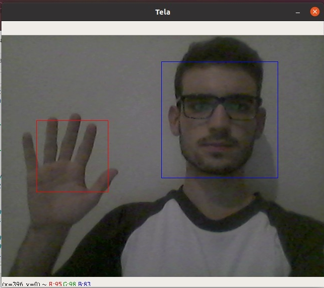

# Reconhecimento de movimentos com OpenCV

## Obs: Projeto em andamento

Repositório com o intuito de auxiliar o aplicativo proposto no projeto da Hackthon CCR. Utilizaremos a biblioteca OpenCV para capturar os movimentos do usuário através da webcam, e verificar se a posição do usuário está correta para o exercício apresentado no aplicativo.

## Feitos:
<ul>
  <li>Consegue identificar mão e rosto</li>
</ul>

## Próximos passos:
<ul>
  <li>Identificar os pés</li>
  <li>Melhorar a identificação das mãos</li>
  <li>Validar a posição correta para cada exercício físico</li>
</ul>

## Testes
No teste abaixo, o modelo consegue identificar a mão e o rosto do usuário. O quadrado azul identifica o rosto e o vermelho a mão.  

<b>Considerações:</b> o modelo não identifica muito bem quando colocamos as duas mãos e o rosto.
Vale ressaltar que o projeto se encontra em desenvolvimento, e o que foi desenvolvido até agora, tem como objetivo mostrar a viabilidade do uso do reconhecimento corporal para capturar um determinado movimento do usuário.

## Sobre o Projeto

Foi desenvolvido por André Vinícius para apresentação no Hackathon da CCR 2020.
Equipe 317: B.E.M - Boleia em Movimento: 
<ul>
  <li><a href='https://www.linkedin.com/in/andre-vinicius-mendes-barros-800410195/'> André Vinícius</a></li>
  <li><a href='https://www.linkedin.com/in/cristiane-f-silva-florin-ba516a34/'> Cristiane Florin</a></li>
  <li><a href='https://www.linkedin.com/in/dieimerson-vieira/'> Dieimerson Vieira</a></li>
  <li><a href='https://www.linkedin.com/in/f%C3%A1bio-s-cardoso/'> Fábio Cardoso</a></li>
  <li><a href='https://www.linkedin.com/in/igorjuniomelo/'> Igor Junio</a></li>
</ul>
